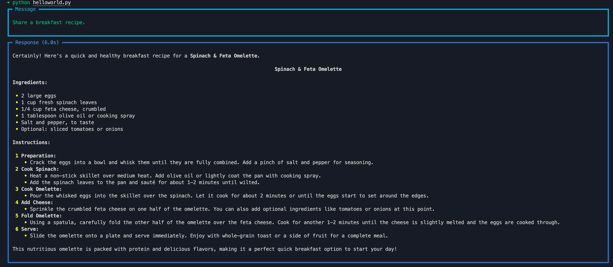
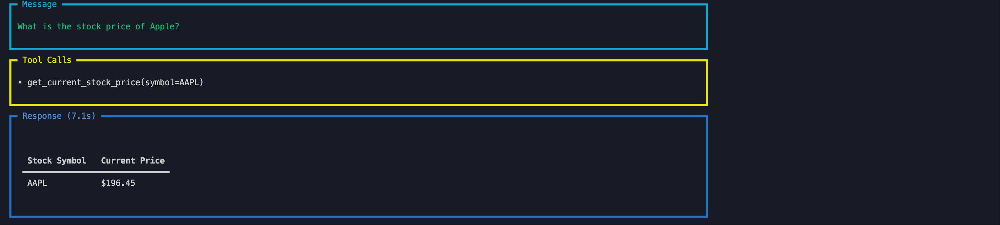
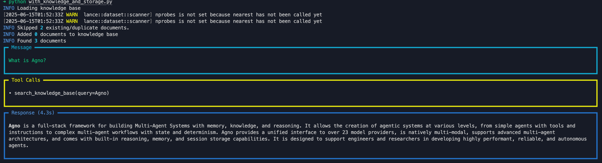
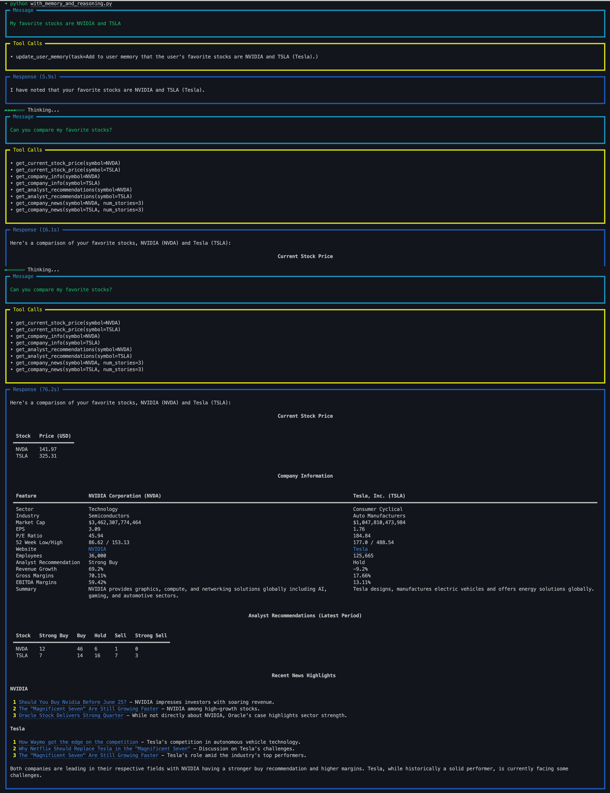

# Agno Hello World Examples

A collection of examples demonstrating how to use Agno to build Multi-Agent Systems with memory, knowledge and reasoning. These examples show the progression from simple agents to sophisticated multi-agent teams across Agno's 5 levels of agentic systems.

## 🚀 Features

- **Model Agnostic**: Agno provides a unified interface to 23+ model providers, no lock-in.
- **Highly performant**: Agents instantiate in **~3μs** and use **~6.5Kib** memory on average.
- **Reasoning is a first class citizen**: Reasoning improves reliability and is a must-have for complex autonomous agents. Agno supports 3 approaches to reasoning: Reasoning Models, `ReasoningTools` or our custom `chain-of-thought` approach.
- **Natively Multi-Modal**: Agno Agents are natively multi-modal, they accept text, image, audio and video as input and generate text, image, audio and video as output.
- **Advanced Multi-Agent Architecture**: Agno provides an industry leading multi-agent architecture (**Agent Teams**) with reasoning, memory, and shared context.
- **Built-in Agentic Search**: Agents can search for information at runtime using 20+ vector databases. Agno provides state-of-the-art Agentic RAG, **fully async and highly performant.**
- **Built-in Memory & Session Storage**: Agents come with built-in `Storage` & `Memory` drivers that give your Agents long-term memory and session storage.
- **Structured Outputs**: Agno Agents can return fully-typed responses using model provided structured outputs or `json_mode`.
- **Pre-built FastAPI Routes**: After building your Agents, serve them using pre-built FastAPI routes. 0 to production in minutes.
- **Monitoring**: Monitor agent sessions and performance in real-time on [agno.com](https://app.agno.com).

### 5 Levels of Agentic Systems

- **Level 1**: `with_tools.py` - Agents with tools and instructions
- **Level 2**: `with_knowledge_and_storage.py` - Agents with knowledge and storage
- **Level 3**: `with_memory_and_reasoning.py` - Agents with memory and reasoning
- **Level 4**: Agent Teams that can reason and collaborate (see [cookbook](https://github.com/agno-agi/agno/tree/main/cookbook))
- **Level 5**: Agentic Workflows with state and determinism (see [cookbook](https://github.com/agno-agi/agno/tree/main/cookbook))

## ⚡ Quick Start

1. Install dependencies:
```shell
pip install -r requirements.txt
```

2. Set up environment:
```bash
export OPENAI_API_KEY=your-openai-api-key
```

3. Run any example:
```shell
python helloworld.py
python with_tools.py
python with_knowledge_and_storage.py
python with_memory_and_reasoning.py
```

## 📋 Examples Overview

### 1. Hello World - Basic Agent (`helloworld.py`)
A simple agent that shares healthy recipes.

```python
from agno.agent import Agent
from agno.models.openai import OpenAIChat

agent = Agent(
    model=OpenAIChat(id="gpt-4o"),
    description="Share 15 minute healthy recipes.",
    markdown=True,
)
agent.print_response("Share a breakfast recipe.", stream=True)
```

**Expected output:**


### 2. Agent with Tools (`with_tools.py`)
Demonstrates Level 1: Agents with tools and instructions using YFinance for stock data.

```python
from agno.agent import Agent
from agno.models.openai import OpenAIChat
from agno.tools.yfinance import YFinanceTools

agent = Agent(
    model=OpenAIChat(id="gpt-4o"),
    tools=[YFinanceTools(stock_price=True)],
    instructions="Use tables to display data. Don't include any other text.",
    markdown=True,
)
agent.print_response("What is the stock price of Apple?", stream=True)
```

**Expected output:**


### 3. Agent with Knowledge and Storage (`with_knowledge_and_storage.py`)
Demonstrates Level 2: Agents with knowledge and storage using URL knowledge and SQLite storage.

```python
from agno.agent import Agent
from agno.embedder.openai import OpenAIEmbedder
from agno.models.openai import OpenAIChat
from agno.knowledge.url import UrlKnowledge
from agno.storage.sqlite import SqliteStorage
from agno.vectordb.lancedb import LanceDb, SearchType

# Load Agno documentation in a knowledge base
knowledge = UrlKnowledge(
    urls=["https://docs.agno.com/introduction.md"],
    vector_db=LanceDb(
        uri="tmp/lancedb",
        table_name="agno_docs",
        search_type=SearchType.hybrid,
        embedder=OpenAIEmbedder(id="text-embedding-3-small", dimensions=1536),
    ),
)

# Store agent sessions in a SQLite database
storage = SqliteStorage(table_name="agent_sessions", db_file="tmp/agent.db")

agent = Agent(
    name="Agno Assist",
    model=OpenAIChat(id="gpt-4o"),
    instructions=[
        "Search your knowledge before answering the question.",
        "Only include the output in your response. No other text.",
    ],
    knowledge=knowledge,
    storage=storage,
    add_datetime_to_instructions=True,
    add_history_to_messages=True,
    num_history_runs=3,
    markdown=True,
)

if __name__ == "__main__":
    # Load the knowledge base, comment out after first run
    agent.knowledge.load(recreate=False)
    agent.print_response("What is Agno?", stream=True)
```

**Expected output:**


### 4. Agent with Memory and Reasoning (`with_memory_and_reasoning.py`)
Demonstrates Level 3: Agents with memory and reasoning using SQLite memory and reasoning tools.

```python
from agno.agent import Agent
from agno.memory.v2.db.sqlite import SqliteMemoryDb
from agno.memory.v2.memory import Memory
from agno.models.openai import OpenAIChat
from agno.tools.reasoning import ReasoningTools
from agno.tools.yfinance import YFinanceTools

memory = Memory(
    model=OpenAIChat(id="gpt-4o"),
    db=SqliteMemoryDb(table_name="user_memories", db_file="tmp/agent.db"),
    delete_memories=True,
    clear_memories=True,
)

agent = Agent(
    model=OpenAIChat(id="gpt-4o"),
    tools=[
        ReasoningTools(add_instructions=True),
        YFinanceTools(stock_price=True, analyst_recommendations=True, company_info=True, company_news=True),
    ],
    user_id="ava",
    instructions=[
        "Use tables to display data.",
        "Include sources in your response.",
        "Only include the report in your response. No other text.",
    ],
    memory=memory,
    enable_agentic_memory=True,
    markdown=True,
)

if __name__ == "__main__":
    # This will create a memory that "ava's" favorite stocks are NVIDIA and TSLA
    agent.print_response(
        "My favorite stocks are NVIDIA and TSLA",
        stream=True,
        show_full_reasoning=True,
        stream_intermediate_steps=True,
    )
    # This will use the memory to answer the question
    agent.print_response(
        "Can you compare my favorite stocks?",
        stream=True,
        show_full_reasoning=True,
        stream_intermediate_steps=True,
    )
```

**Expected output:**



## 📁 Project Structure

```
agno/
├── helloworld.py                    # Basic agent example
├── with_tools.py                    # Level 1: Agent with tools
├── with_knowledge_and_storage.py    # Level 2: Agent with knowledge & storage
├── with_memory_and_reasoning.py     # Level 3: Agent with memory & reasoning
├── requirements.txt                 # Dependencies
├── screenshots/                     # Example outputs
│   ├── helloworld.png
│   ├── with_tools.png
│   ├── with_knowledge_and_storage.png
│   └── with_memory_and_reasoning.png
└── tmp/                            # Generated data
    ├── agent.db                    # SQLite database
    └── lancedb/                    # Vector database
```

## 🔗 Learn More

- **Documentation**: [docs.agno.com](https://docs.agno.com)
- **Examples Gallery**: [docs.agno.com/examples](https://docs.agno.com/examples)
- **Cookbook**: [GitHub Cookbook](https://github.com/agno-agi/agno/tree/main/cookbook)
- **Community**: [community.agno.com](https://community.agno.com/)
- **Discord**: [Join our Discord](https://discord.gg/4MtYHHrgA8)

## 📝 Notes

- All examples use OpenAI GPT-4o by default
- Memory and reasoning examples use Anthropic Claude for enhanced reasoning capabilities
- Vector databases and SQLite storage are automatically created in the `tmp/` directory
- Screenshots show expected outputs for each example